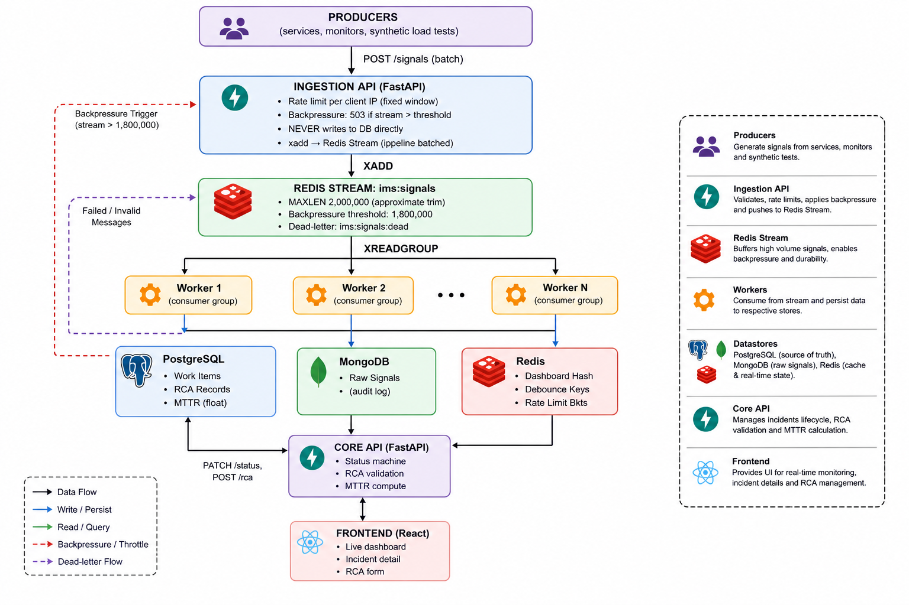

# Incident Management System

## Architecture Diagram

## Overview
Distributed system for ingesting, processing, and analyzing incident signals using FastAPI, Redis Streams, and worker consumers.

## Components
- Producers → send signals
- Ingestion API → validates & pushes to Redis
- Redis Stream → buffering layer
- Workers → process & store data
- Databases → Postgres, MongoDB, Redis
- Core API → incident lifecycle
- Frontend → dashboard & RCA

## Key Features
- Backpressure handling
- Debouncing signals
- MTTR computation
- Horizontal scaling

## Run
docker compose up -d
