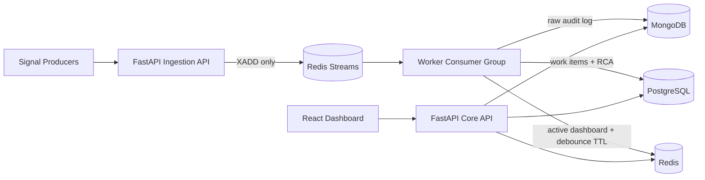

# Incident Management System

A production-style IMS for high-volume failure signals. The system separates ingestion, queueing, worker persistence, source-of-truth workflows, raw audit storage, and dashboard cache state.

## Architecture



## Services

- `ingestion`: async FastAPI producer, `POST /signals`, no synchronous DB writes.
- `worker`: Redis Stream consumer group processor for persistence, debounce, dashboard cache, metrics.
- `api`: async FastAPI incident workflow API.
- `frontend`: React + Vite dashboard.
- `redis`: queue, rate limit counters, debounce keys, active incident cache.
- `mongo`: raw signal audit store.
- `postgres`: transactional work items and RCA source of truth.

## Run

```bash
docker compose up --build
```

Open:

- Frontend: `http://localhost:5173`
- Core API: `http://localhost:8000`
- Ingestion API: `http://localhost:8001`

Ingest the sample data:

```bash
curl -X POST http://localhost:8001/signals \
  -H "Content-Type: application/json" \
  --data-binary @sample-data/failures.json
```

Scale workers:

```bash
docker compose up --scale worker=4
```

Run backend tests inside a backend container:

```bash
docker compose run --rm api pytest
```

Simulate 10k signals/sec:

```bash
docker compose run --rm api python scripts/load_test.py --rate 10000 --duration 30 --endpoint http://ingestion:8001/signals
```

## API

Ingestion:

- `GET /health`
- `POST /signals` accepts one signal or an array of signals.

Core:

- `GET /health`
- `GET /incidents/active`
- `GET /incidents/{id}`
- `GET /incidents/{id}/signals`
- `PATCH /incidents/{id}/status`
- `POST /incidents/{id}/rca`
- `POST /incidents/{id}/close`

## Backpressure Strategy

Ingestion validates and rate-limits requests, then writes to Redis Streams. It never writes to MongoDB or PostgreSQL, so slow persistence does not crash the hot path. Redis Streams absorb bursts, workers drain independently using consumer groups, and worker replicas can be scaled horizontally. DB writes use retry with exponential backoff. Pending stream entries remain unacked when processing fails, preserving durability for recovery.

## Debouncing

Workers use `debounce:component:{component_id}` Redis TTL keys with a 10-second expiry. A Redis lock key prevents races when multiple workers see the first signal for the same component. Within the debounce window, every raw signal is persisted to MongoDB and linked to the single PostgreSQL work item.

## Design Patterns

- State Pattern: `ims.state` defines legal transitions for `OPEN -> INVESTIGATING -> RESOLVED -> CLOSED`.
- Strategy Pattern: `ims.alerting` maps RDBMS failures to `P0`, cache failures to `P2`, and falls back to submitted severity.

## RCA and MTTR

Closing requires a complete RCA. RCA submission sets `end_time` and calculates:

```text
MTTR = RCA submission time - first signal time
```

The API rejects `CLOSED` if RCA is missing or incomplete.

## Scaling Notes

- Increase ingestion replicas for more HTTP producer capacity.
- Increase worker replicas with `docker compose up --scale worker=N`.
- Use Redis Cluster or managed Redis for production queue capacity.
- Use managed MongoDB with indexes on `work_item_id`, `component_id`, and `timestamp`.
- Use managed PostgreSQL with connection pooling and migrations for production.
